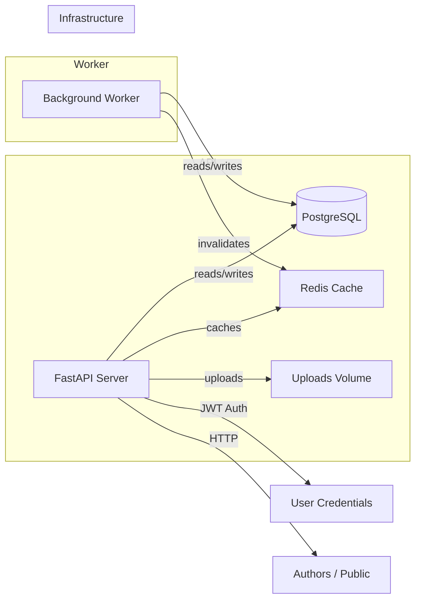

# Architecture Overview

The CMS backend is composed of several containerized components that collaborate to provide a resilient, scalable service. The following diagram (Mermaid) visualizes the high-level architecture.

## Component Descriptions

- **FastAPI Server**: Exposes REST endpoints and handles business logic. Stateless; uses JWT tokens for authentication and role checks. Implements caching logic around published posts and supports CRUD operations, versioning, scheduling, publishing, search and media upload.

- **PostgreSQL Database**: Stores normalized tables for `users`, `posts`, and `post_revisions`. Indices on timestamps, status, and slugs speed up queries. All multi-table changes are wrapped in transactions to ensure integrity.

- **Redis Cache**: Provides fast read access for published content and list queries. The application uses a cache-aside strategy and explicitly invalidates entries when data changes.

- **Background Worker**: A lightweight Python process that periodically (every 30 seconds) scans for scheduled posts due for publication. It updates their status in a transaction and clears relevant cache entries. Designed to be idempotent.

- **Uploads Volume**: A shared Docker volume mapped to `./uploads` for storing media files. The API serves files out of this directory.

The entire stack is orchestrated via `docker-compose.yml`, which defines separate services for the API, database, cache, and worker. Dependencies ensure the API waits for the database and cache to be ready.